# Production-Grade CI/CD Pipeline with GitHub Actions, Terraform, and Sealed Secrets

This project demonstrates a robust, production-ready Continuous Integration and Continuous Deployment (CI/CD) pipeline setup. It utilizes **GitHub Actions** for automation, **Terraform** for infrastructure provisioning, and **Sealed Secrets** for secure management of sensitive information in **Kubernetes** clusters. This setup is ideal for teams seeking a scalable, secure, and automated deployment workflow.

---

##  Key Features

- **Automated CI/CD:** Leverages GitHub Actions to streamline build, test, and deployment processes.
- **Infrastructure as Code (IaC):** Uses Terraform to manage cloud infrastructure declaratively.
- **Secrets Management:** Implements Bitnami’s Sealed Secrets to safely store and deploy secrets into Kubernetes.
- **Modular and Scalable:** Designed with maintainability and real-world scalability in mind.

---

## Project Architecture

```mermaid
flowchart TB
  %% Theme styling
  classDef dev fill:#e0f7fa,stroke:#00796b,stroke-width:2px;
  classDef ci fill:#fff3e0,stroke:#fb8c00,stroke-width:2px;
  classDef aws fill:#ede7f6,stroke:#673ab7,stroke-width:2px;
  classDef k8s fill:#e8f5e9,stroke:#2e7d32,stroke-width:2px;
  classDef secure fill:#fce4ec,stroke:#c2185b,stroke-width:2px;

  %% Developer
  subgraph DEV["👨‍💻 Developer"]
    A1["💻 Push Code to GitHub"]:::dev
  end

  %% CI/CD Flow
  subgraph CICD["🔁 GitHub Actions"]
    B1["⚙️ Workflow Triggered"]:::ci
    B2["🛡️ tfsec - Scan Terraform"]:::secure
    B3["🔍 Trivy - Scan Docker"]:::secure
    B4["🔐 Sealed Secrets CLI"]:::secure
  end

  %% AWS Infra
  subgraph AWS["☁️ AWS (Terraform Managed)"]
    C1["📦 S3 - Artifacts"]:::aws
    C2["🔧 CodeBuild"]:::aws
    C3["🚀 CodeDeploy"]:::aws
    C4["🔁 CodePipeline"]:::aws
    C5["🔐 IAM Policies"]:::aws
  end

  %% Kubernetes Cluster
  subgraph K8S["☸️ Kubernetes Cluster"]
    D1["🔒 SealedSecrets Controller"]:::k8s
    D2["🧩 Secret-based Deployment"]:::k8s
    D3["📦 App Workloads"]:::k8s
  end

  %% Flow
  A1 --> B1
  B1 --> B2
  B1 --> B3
  B1 --> B4
  B1 --> C4

  C4 --> C1
  C4 --> C2
  C4 --> C3
  C4 --> C5

  B4 --> D1
  D1 --> D2
  C3 --> D3

  %% Clickable nodes
  click B2 "https://aquasecurity.github.io/tfsec/" _blank
  click B3 "https://aquasecurity.github.io/trivy/" _blank
  click B4 "https://github.com/bitnami-labs/sealed-secrets" _blank
  click C2 "https://docs.aws.amazon.com/codebuild/latest/userguide/welcome.html" _blank
  click C3 "https://docs.aws.amazon.com/codedeploy/latest/userguide/welcome.html" _blank
  click C4 "https://docs.aws.amazon.com/codepipeline/latest/userguide/welcome.html" _blank
  click D1 "https://github.com/bitnami-labs/sealed-secrets" _blank
```


<!-- ```mermaid
flowchart LR
  %% Direction left to right
  direction LR

  %% Developer Side
  subgraph Dev["👨‍💻 Developer Workspace"]
    A1["📝 Code Commit & Push"]
  end

  %% GitHub CI/CD Flow
  subgraph CI["🔄 GitHub Actions CI/CD Pipeline"]
    B1["🛠️ CI Job Trigger"]
    B2["🔐 Run tfsec (Terraform Audit)"]
    B3["🧪 Run Trivy (Docker Scan)"]
    B4["📜 Encrypt with Sealed Secrets"]
  end

  %% Terraform Infra on AWS
  subgraph Cloud["☁️ AWS Infra Provisioning"]
    C1["📂 S3 Bucket\n(Stores Build Artifacts)"]
    C2["🔨 CodeBuild\n(Build + Test)"]
    C3["📤 CodeDeploy\n(Deploy to EC2)"]
    C4["🔗 CodePipeline\n(Workflow Manager)"]
    C5["🛡️ IAM Policies\n(Permission Control)"]
  end

  %% Kubernetes
  subgraph Kube["☸️ Kubernetes Cluster"]
    D1["🔒 Sealed Secrets Controller"]
    D2["🧩 Secret-Enabled Deployments"]
    D3["📦 App Workloads"]
  end

  %% Flow Connections
  A1 --> B1
  B1 --> B2
  B1 --> B3
  B1 --> B4
  B4 --> D1
  D1 --> D2
  D2 --> D3

  B1 --> C4
  C4 --> C1
  C4 --> C2
  C4 --> C3
  C4 --> C5
``` -->

##  Technologies Used

| Tool               | Purpose                                           |
| ------------------ | ------------------------------------------------- |
| **GitHub Actions** | Automates CI/CD pipelines                         |
| **Terraform**      | Infrastructure provisioning and environment setup |
| **Sealed Secrets** | Secure secrets management in Kubernetes           |
| **Kubernetes**     | Container orchestration platform                  |
| **Docker**         | Containerizes the application                     |

---

##  Project Structure

```bash
.
├── .github/workflows/        # GitHub Actions CI/CD pipelines
│   └── ci-cd.yaml            # Main workflow configuration
├── terraform/                # Terraform configurations
│   ├── main.tf               # Entry point for Terraform
│   ├── variables.tf          # Input variables
│   ├── outputs.tf            # Output values
│   └── secrets/              # Sealed Secrets YAML files
├── manifests/                # Kubernetes deployment and service definitions
├── docker/                   # Docker build and configuration files
├── .env                      # Environment variables (not committed)
├── README.md                 # Project documentation
└── ...                       # Your application code
```

---

##  Secure Secrets with Sealed Secrets

Sealed Secrets allow you to store encrypted Kubernetes secrets in a public or private Git repository.

### How it Works

1. **Install Sealed Secrets Controller** in your Kubernetes cluster.
2. **Encrypt secrets** using the cluster's public key.
3. **Commit sealed secrets** to your Git repo.
4. On deployment, the controller decrypts them into native Kubernetes Secrets.

### Steps to Seal a Secret

```bash
kubectl create secret generic my-secret \
  --from-literal=username=admin \
  --from-literal=password=secretpass \
  --dry-run=client -o yaml > my-secret.yaml

kubeseal --format=yaml < my-secret.yaml > my-secret-sealed.yaml
```

>  Commit only the `*-sealed.yaml` files to your repository.

---

##  GitHub Actions CI/CD Workflow

Located at `.github/workflows/ci-cd.yaml`, this workflow automates build, test, and deploy operations.

###  CI (Continuous Integration)

1. **Trigger**: On every push or pull request to `main` or `develop`
2. **Steps**:
   - Checkout repo
   - Set up environment (e.g., Node.js, Python, Docker)
   - Run linter, formatter, and tests

###  CD (Continuous Deployment)

1. **Trigger**: On merge to `main` branch
2. **Steps**:
   - Authenticate to cloud provider (via GitHub secrets)
   - Run `terraform init`, `plan`, `apply`
   - Deploy sealed secrets
   - Apply Kubernetes manifests using `kubectl apply`

### Sample Workflow Snippet

```yaml
jobs:
  build-deploy:
    runs-on: ubuntu-latest
    steps:
      - name: Checkout
        uses: actions/checkout@v3

      - name: Set up Terraform
        uses: hashicorp/setup-terraform@v2

      - name: Terraform Init
        run: terraform init

      - name: Terraform Plan
        run: terraform plan

      - name: Terraform Apply
        run: terraform apply -auto-approve

      - name: Deploy to Kubernetes
        run: |
          kubectl apply -f manifests/
          kubectl apply -f terraform/secrets/
```

---

##  Setting Up Locally

### Prerequisites

- [Terraform](https://www.terraform.io/downloads)
- [kubectl](https://kubernetes.io/docs/tasks/tools/)
- [kubeseal](https://github.com/bitnami-labs/sealed-secrets/releases)
- Access to a Kubernetes cluster
- GitHub repository with appropriate secrets configured

### Step-by-Step Guide

```bash
# Clone the repository
$ git clone https://github.com/your-org/your-repo.git
$ cd your-repo

# Initialize and apply Terraform
$ cd terraform
$ terraform init
$ terraform plan
$ terraform apply -auto-approve

# Seal and deploy secrets
$ kubectl apply -f secrets/

# Deploy your app
$ kubectl apply -f ../manifests/
```

---

##  Testing Your Workflow

- Test infrastructure provisioning by running Terraform manually
- Push changes to a feature branch and create a pull request
- Monitor workflow runs under the GitHub Actions tab
- Check if secrets are correctly decrypted and applied in Kubernetes

---

##  GitHub Secrets Configuration

Set these in your repository settings under `Settings → Secrets and variables → Actions`

| Secret Name     | Purpose                         |
| --------------- | ------------------------------- |
| `CLOUD_API_KEY` | API Key for your cloud provider |
| `KUBE_CONFIG`   | Base64 encoded kubeconfig file  |
| `GITHUB_TOKEN`  | (Default provided)              |

>  Use `base64 ~/.kube/config` to encode your kubeconfig.

---

## 🛡 Security Best Practices

- Use **Sealed Secrets** instead of raw Secrets.
- Avoid storing `.env` or sensitive files in version control.
- **Limit Terraform permissions** using least privilege.
- Regularly **rotate your API keys**.
- Use branch protection rules to guard `main`.

---

##  Additional Resources

- [Terraform Docs](https://developer.hashicorp.com/terraform/docs)
- [GitHub Actions Docs](https://docs.github.com/en/actions)
- [Sealed Secrets Guide](https://github.com/bitnami-labs/sealed-secrets)
- [Kubernetes Concepts](https://kubernetes.io/docs/concepts/)

---

##  Contributing

Contributions are welcome! To contribute:

1. Fork the repository
2. Create your feature branch (`git checkout -b feature/your-feature`)
3. Commit your changes
4. Push to the branch
5. Open a Pull Request
